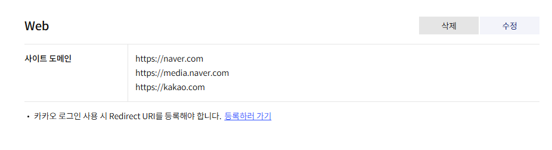
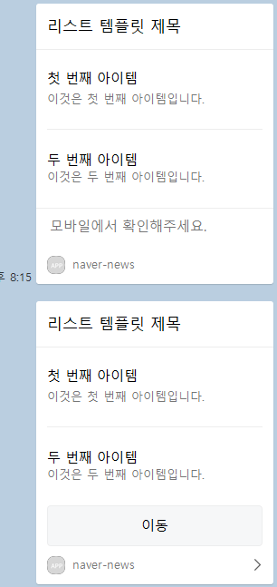
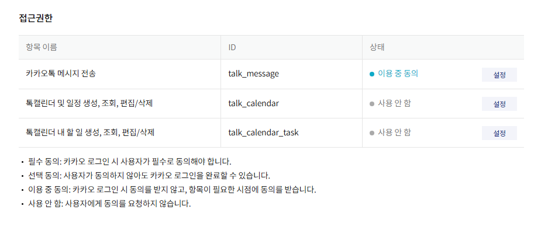

# Python, kakao-api-restful-msg
> 나에게 카카오 api 메신저 사용법 기록

## redirect_uri 설정
> rest ful 방식은 access token이 필요해서 토큰 받으려면 없는 사이트를 넣어서 하는게 좋음 <br>

```
'https://kauth.kakao.com/oauth/authorize?client_id={api_key}&redirect_uri={redirect_uri}&response_type=code&scope=talk_message'
```
<br>

> 나는 아래 url로 접속해서 토큰을 가져왔다. <br>

```
'https://kauth.kakao.com/oauth/authorize?client_id={api_key}&redirect_uri=https://localhost.com&response_type=code&scope=talk_message'
```
<br>

> 해당 링크로 접속해서 로그인하고 잠시만 기다리면 ?code='' 값이 나오는데 해당 값이 access token 이다.

## kakao_code.json 생성
> rest ful api key, redirect_uri, access token을 넣어주면 <br> 2번 형태 값을 가진 json 파일이 생성된다.

1.
```
import requests

# scope=talk_message, 이거 안넣어주면 403 에러 발생
get_token_url = 'https://kauth.kakao.com/oauth/authorize?client_id={api_key}&redirect_uri={redirect_uri}&response_type=code&scope=talk_message'

url = 'https://kauth.kakao.com/oauth/token'
rest_api_key = ''
redirect_uri = ''
authorize_code = '' # access token

data = {
    'grant_type':'authorization_code',
    'client_id':rest_api_key,
    'redirect_uri':redirect_uri,
    'code': authorize_code,
    }

response = requests.post(url, data=data)
tokens = response.json()
print(tokens)

# json 저장
import json

with open("kakao_code.json","w") as fp:
    json.dump(tokens, fp)
```

2.
```
{"access_token": "", "token_type": "bearer", "refresh_token": "", "expires_in": 0, "scope": "", "refresh_token_expires_in":0}
```

## 도메인설정
> 도메인 설정 안해주면 카톡에 메신저 보낼때 사이트 이동이 안된다. <br> 사용 할 사이트는 도메인 설정을 꼭 해줘야 한다.



## 도메인 설정 안하면
> 위 : 도메인 설정 x (페이지 이동 안됨)<br>
> 아래 : 도메인 설정 o (페이지 이동 됨)<br>



## 권한설정
> 나는 메세지만 사용할 거라서 해당 메세지 부분만 사용처리 했다. <br>




## 실행방법
> 위와 같은 순서로 실행 후 main.py를 실행하면 전송 된다.